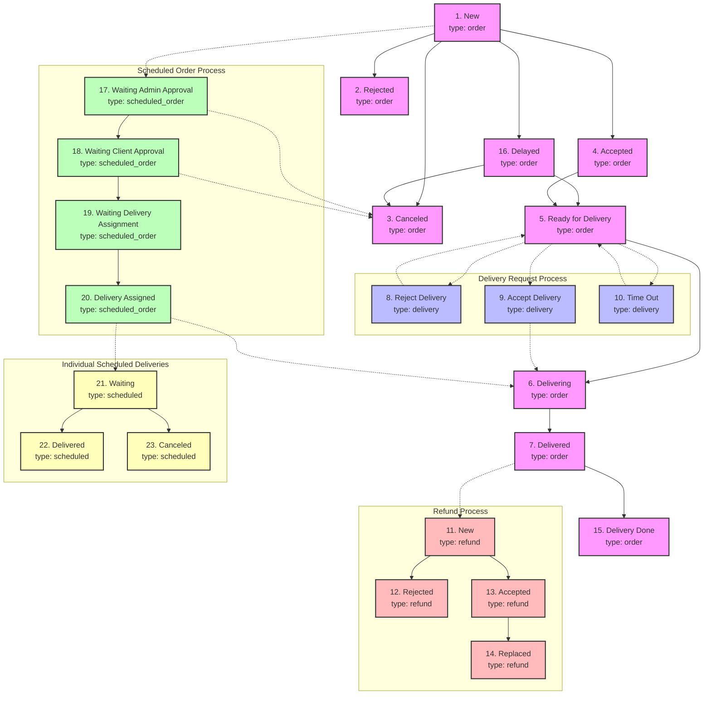

# Order Status Workflow Flowchart

This document provides a comprehensive visual representation of all order status transitions in the ShopLo Backend system.

## Complete Order Status Flowchart

## Explanation of Flowchart Elements

### Node Types
- **Solid boxes with pink background**: Regular order statuses (type: order)
- **Solid boxes with blue background**: Delivery request statuses (type: delivery)
- **Solid boxes with red background**: Refund process statuses (type: refund)
- **Solid boxes with green background**: Scheduled order process statuses (type: scheduled_order)
- **Solid boxes with yellow background**: Individual scheduled delivery statuses (type: scheduled)

### Connection Types
- **Solid arrow lines**: Direct status transitions within the same process
- **Dotted arrow lines**: Connections between different status types/processes

## Detailed Order Status Workflow

### Regular Order Flow
1. Order starts with "New" status
2. Can transition to "Rejected", "Canceled", "Accepted", or "Delayed"
3. "Accepted" orders move to "Ready for Delivery"
4. "Ready for Delivery" orders move to "Delivering" (once a delivery person is assigned)
5. "Delivering" orders move to "Delivered" (when delivery person marks as delivered)
6. "Delivered" orders move to "Delivery Done" (final confirmation)

### Delivery Request Process
- When an order is "Ready for Delivery", delivery requests are sent
- Delivery persons can "Accept" or "Reject" the request
- If no response, request times out
- When accepted, order moves to "Delivering" status

### Scheduled Order Process
- Scheduled orders have a dual status system
- Main order status remains "New" until delivery starts
- Process status moves through:
  1. "Waiting Admin Approval"
  2. "Waiting Client Approval" (after admin approves)
  3. "Waiting Delivery Assignment" (after client approves)
  4. "Delivery Assigned" (when delivery person is assigned)
- After delivery assignment, the main order status follows the regular flow

### Individual Scheduled Deliveries
- Each scheduled delivery has its own status in the "scheduled" type
- Starts as "Waiting"
- Can be marked as "Delivered" or "Canceled"

### Refund Process
- Can be initiated for "Delivered" orders
- Has its own status flow: New → Accepted/Rejected
- Accepted refunds can be marked as "Replaced"

## Common Status Transitions

1. **Cancellation**: 
   - From "New" or "Delayed" → "Canceled"
   - Scheduled orders can be canceled at "Waiting Admin Approval" or "Waiting Client Approval"

2. **Delivery Assignment**:
   - "Ready for Delivery" → "Delivering" (via delivery request acceptance)
   - "Waiting Delivery Assignment" → "Delivery Assigned" (for scheduled orders)

3. **Completion**:
   - "Delivered" → "Delivery Done"
   - "Scheduled Waiting" → "Scheduled Delivered" 